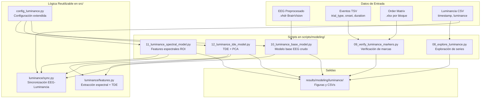

# Documento de Diseño: Predicción de Luminancia Real desde EEG

## Visión General

Este diseño describe un pipeline de 5 scripts incrementales (`08_` a `12_`) en `scripts/modeling/` que extienden el pipeline existente de predicción con joystick (scripts `01_`–`07_`) para predecir luminancia física real desde EEG. Se reutiliza la configuración existente (`config.py`) extendida con parámetros de luminancia, y se añade lógica reutilizable en `src/campeones_analysis/` para sincronización EEG-luminancia y extracción de features espectrales.

El pipeline sigue el patrón establecido: cargar EEG preprocesado (BrainVision) → cargar eventos TSV → cargar Order Matrix → cropear segmentos de video → generar épocas solapadas → construir features → Ridge regression → Leave-One-Video-Out CV → métricas (Pearson r, Spearman ρ, RMSE).

La diferencia clave es que el target (y) pasa de ser el joystick_x (reporte subjetivo) a ser la luminancia física real interpolada desde los CSV de estímulo.

## Arquitectura



## Componentes e Interfaces

### 1. Configuración Extendida: `scripts/modeling/config_luminance.py`

Extiende `config.py` con parámetros específicos de luminancia. Sigue el patrón existente de constantes de módulo.

```python
from pathlib import Path
from config import EEG_CHANNELS

# --- Parámetros de Épocas (nuevos) ---
EPOCH_DURATION_S: float = 0.5       # 500ms
EPOCH_OVERLAP_S: float = 0.4        # 400ms solapamiento
EPOCH_STEP_S: float = 0.1           # 100ms paso

# --- ROI Posterior/Occipital ---
POSTERIOR_CHANNELS: list[str] = [
    "O1", "O2", "P3", "P4", "P7", "P8", "Pz",
    "CP1", "CP2", "CP5", "CP6",
]

# --- Bandas Espectrales ---
SPECTRAL_BANDS: dict[str, tuple[float, float]] = {
    "delta": (1.0, 4.0),
    "theta": (4.0, 8.0),
    "alpha": (8.0, 13.0),
    "beta": (13.0, 30.0),
    "gamma": (30.0, 45.0),
}

# --- TDE ---
TDE_WINDOW_HALF: int = 10  # ±10 puntos → 21 puntos totales
TDE_PCA_COMPONENTS: int = 50

# --- Pipeline ML ---
PCA_COMPONENTS: int = 100
RIDGE_ALPHA: float = 1.0
RANDOM_SEED: int = 42

# --- Rutas (relativas al proyecto) ---
PROJECT_ROOT: Path = Path(__file__).resolve().parents[2]
DERIVATIVES_PATH: Path = PROJECT_ROOT / "data" / "derivatives" / "campeones_preproc"
XDF_PATH: Path = PROJECT_ROOT / "data" / "sourcedata" / "xdf"
STIMULI_PATH: Path = PROJECT_ROOT / "stimuli" / "luminance"
RESULTS_PATH: Path = PROJECT_ROOT / "results" / "modeling" / "luminance"

# --- Mapeo video_id → archivo CSV de luminancia ---
LUMINANCE_CSV_MAP: dict[int, str] = {
    3: "green_intensity_video_3.csv",
    7: "green_intensity_video_7.csv",
    9: "green_intensity_video_9.csv",
    12: "green_intensity_video_12.csv",
}

# --- Videos experimentales (excluyendo video 1 = práctica) ---
EXPERIMENTAL_VIDEOS: list[int] = [3, 7, 9, 12]

# --- Sujeto y Runs ---
SUBJECT: str = "27"
SESSION: str = "vr"
RUNS_CONFIG: list[dict] = [
    {"id": "002", "acq": "a", "block": "block1", "task": "01"},
    {"id": "003", "acq": "a", "block": "block2", "task": "02"},
    {"id": "004", "acq": "a", "block": "block3", "task": "03"},
    {"id": "006", "acq": "a", "block": "block4", "task": "04"},
    {"id": "007", "acq": "b", "block": "block1", "task": "01"},
    {"id": "009", "acq": "b", "block": "block3", "task": "03"},
    {"id": "010", "acq": "b", "block": "block4", "task": "04"},
]
```

### 2. Módulo de Sincronización: `src/campeones_analysis/luminance/sync.py`

Funciones puras para alinear luminancia con épocas EEG.

```python
def load_luminance_csv(csv_path: Path) -> pd.DataFrame:
    """Carga un CSV de luminancia y retorna DataFrame con columnas timestamp, luminance."""
    ...

def interpolate_luminance_to_epochs(
    luminance_df: pd.DataFrame,
    epoch_onsets_s: np.ndarray,
    epoch_duration_s: float,
    video_onset_s: float,
) -> np.ndarray:
    """Interpola valores de luminancia para cada época EEG.

    Para cada época, calcula el promedio de luminancia dentro de la ventana
    temporal correspondiente, alineando el timestamp del CSV de luminancia
    con el onset del video en el EEG.

    Args:
        luminance_df: DataFrame con columnas 'timestamp' y 'luminance'.
        epoch_onsets_s: Array de onsets de cada época relativos al inicio del video (en segundos).
        epoch_duration_s: Duración de cada época en segundos.
        video_onset_s: Onset del video en el EEG (no usado directamente, las épocas ya son relativas).

    Returns:
        Array de valores de luminancia promedio por época.
    """
    ...

def create_epoch_onsets(
    n_samples_total: int,
    sfreq: float,
    epoch_duration_s: float,
    epoch_step_s: float,
) -> np.ndarray:
    """Genera array de onsets de épocas en segundos relativos al inicio del segmento.

    Args:
        n_samples_total: Número total de muestras en el segmento EEG.
        sfreq: Frecuencia de muestreo del EEG.
        epoch_duration_s: Duración de cada época en segundos.
        epoch_step_s: Paso entre épocas en segundos.

    Returns:
        Array 1D con los onsets de cada época en segundos.
    """
    ...
```

### 3. Módulo de Features: `src/campeones_analysis/luminance/features.py`

Funciones puras para extracción de features espectrales y TDE.

```python
def extract_bandpower(
    eeg_epoch: np.ndarray,
    sfreq: float,
    bands: dict[str, tuple[float, float]],
) -> np.ndarray:
    """Extrae potencia espectral por banda para cada canal de una época.

    Usa el método de Welch (scipy.signal.welch) para estimar la PSD,
    luego integra la potencia en cada banda de frecuencia.

    Args:
        eeg_epoch: Array 2D (n_channels, n_samples) de una época EEG.
        sfreq: Frecuencia de muestreo.
        bands: Diccionario {nombre_banda: (freq_min, freq_max)}.

    Returns:
        Array 1D de dimensión (n_channels * n_bands,) con la potencia por banda y canal.
    """
    ...

def apply_time_delay_embedding(
    feature_matrix: np.ndarray,
    window_half: int,
) -> np.ndarray:
    """Aplica Time Delay Embedding a una matriz de features secuenciales.

    Para cada muestra i, concatena los vectores de features de las muestras
    [i - window_half, ..., i, ..., i + window_half], resultando en un vector
    de dimensión (2 * window_half + 1) * n_features_original.

    Las muestras en los bordes (donde no hay suficiente contexto) se descartan.

    Args:
        feature_matrix: Array 2D (n_epochs, n_features) de features secuenciales.
        window_half: Mitad de la ventana de embedding (±window_half puntos).

    Returns:
        Array 2D (n_epochs - 2*window_half, n_features * (2*window_half + 1))
        con los features expandidos.
    """
    ...
```

### 4. Scripts de Pipeline

Cada script sigue el patrón existente de `run_pipeline()` con `if __name__ == '__main__'`.

**08_explore_luminance.py**: Carga los 4 CSVs, genera plots de series crudas y diffs, imprime estadísticas.

**09_verify_luminance_markers.py**: Para cada run de sub-27, carga eventos TSV y Order Matrix, identifica eventos `video_luminance`, cruza con `video_id` de la Order Matrix, reporta mapeo y discrepancias.

**10_luminance_base_model.py**: Pipeline completo con EEG crudo vectorizado → PCA → Ridge. Target = luminancia interpolada. Épocas 500ms/400ms overlap. Leave-One-Video-Out CV.

**11_luminance_spectral_model.py**: Igual que 10 pero extrae bandpower de ROI_Posterior en vez de vectorizar EEG crudo. Compara resultados con modelo base.

**12_luminance_tde_model.py**: Igual que 11 pero aplica TDE ±10 puntos sobre features espectrales, seguido de PCA. Compara con modelo sin TDE.

## Modelos de Datos

### Época Sincronizada (dict en lista, patrón existente)

```python
epoch_entry = {
    "X": np.ndarray,           # (n_channels, n_samples) para modelo base
                                # (n_features,) para modelo espectral
    "y": float,                 # luminancia promedio en la ventana
    "video_id": int,            # ID del video (3, 7, 9, 12)
    "video_identifier": str,    # "{video_id}_{acq}" para CV grouping
    "run_id": str,              # ID del run
    "acq": str,                 # "a" o "b"
}
```

### Resultados por Fold (CSV de salida)

| Columna | Tipo | Descripción |
|---------|------|-------------|
| Subject | str | ID del sujeto |
| Acq | str | Adquisición (a/b) |
| Model | str | "base", "spectral", "tde" |
| TestVideo | str | Identificador del video de test |
| TrainSize | int | Número de épocas de entrenamiento |
| TestSize | int | Número de épocas de test |
| PearsonR | float | Correlación de Pearson |
| SpearmanRho | float | Correlación de Spearman |
| RMSE | float | Root Mean Squared Error |

### Reporte de Verificación de Marcas (CSV de salida)

| Columna | Tipo | Descripción |
|---------|------|-------------|
| run_id | str | ID del run |
| acq | str | Adquisición |
| task | str | ID de la tarea |
| event_onset | float | Onset del evento video_luminance |
| event_duration | float | Duración del evento |
| event_value | int | Valor del evento |
| order_matrix_video_id | int | video_id según Order Matrix |
| csv_filename | str | Archivo CSV de luminancia esperado |
| match_status | str | "ok" o "mismatch" |


## Propiedades de Correctitud

*Una propiedad es una característica o comportamiento que debe mantenerse verdadero en todas las ejecuciones válidas de un sistema — esencialmente, una declaración formal sobre lo que el sistema debe hacer. Las propiedades sirven como puente entre especificaciones legibles por humanos y garantías de correctitud verificables por máquina.*

Las siguientes propiedades se derivan del análisis de los criterios de aceptación de los requisitos. Cada propiedad está universalmente cuantificada y es verificable mediante property-based testing.

### Property 1: La serie de diferencias temporales tiene longitud N-1

*Para cualquier* serie de luminancia de longitud N (N ≥ 2), la serie de diferencias temporales calculada debe tener longitud N-1, y cada valor diff[i] debe ser igual a luminance[i+1] - luminance[i].

**Validates: Requirements 1.2**

### Property 2: Invariantes de estadísticas descriptivas de luminancia

*Para cualquier* serie de luminancia no vacía, las estadísticas descriptivas deben cumplir: min ≤ mean ≤ max, std ≥ 0, y todos los valores de luminancia deben estar en el rango [0, 255] (canal verde de 8 bits).

**Validates: Requirements 1.4**

### Property 3: Filtrado de eventos video_luminance

*Para cualquier* DataFrame de eventos EEG, filtrar por trial_type == 'video_luminance' debe retornar exclusivamente filas con ese trial_type, y el número de filas retornadas debe ser ≤ al número total de filas.

**Validates: Requirements 2.1**

### Property 4: Conteo y espaciado de épocas generadas

*Para cualquier* segmento EEG de duración total T segundos, con época de duración D y paso S, el número de épocas generadas debe ser floor((T - D) / S) + 1, y los onsets consecutivos deben estar separados exactamente por S segundos.

**Validates: Requirements 3.2**

### Property 5: Luminancia interpolada dentro de rango válido

*Para cualquier* archivo de luminancia CSV y cualquier conjunto de épocas alineadas, cada valor de luminancia promediado por época debe estar dentro del rango [min(luminancia_original), max(luminancia_original)].

**Validates: Requirements 3.1, 3.3**

### Property 6: Correctitud del split Leave-One-Video-Out

*Para cualquier* conjunto de épocas con N videos distintos, cada fold de Leave-One-Video-Out debe tener: (a) el test set conteniendo exclusivamente épocas de un único video, (b) el training set conteniendo épocas de todos los demás videos, (c) la unión de train y test igual al conjunto total, y (d) N folds en total.

**Validates: Requirements 3.5, 4.4, 5.4**

### Property 7: Invariantes de extracción de bandpower

*Para cualquier* época EEG de forma (n_channels, n_samples) y conjunto de K bandas de frecuencia, la extracción de bandpower debe producir un vector de dimensión (n_channels × K) donde todos los valores son ≥ 0 (la potencia espectral es no negativa).

**Validates: Requirements 4.1, 4.3**

### Property 8: Selección de canales ROI es subconjunto válido

*Para cualquier* lista de canales EEG disponibles y la definición de ROI_Posterior, los canales seleccionados deben ser un subconjunto de ROI_Posterior y un subconjunto de los canales disponibles (intersección).

**Validates: Requirements 4.2**

### Property 9: Forma y contenido del Time Delay Embedding

*Para cualquier* matriz de features de forma (N, F) con N > 2×W (donde W es window_half), el TDE debe producir una matriz de forma (N - 2×W, F × (2×W + 1)), y la fila i del resultado debe contener la concatenación de las filas [i, i+1, ..., i+2×W] de la matriz original.

**Validates: Requirements 5.1, 5.2**

### Property 10: Reducción de dimensionalidad por PCA

*Para cualquier* matriz de features de forma (N, F_expandido) y un número de componentes C configurado, la salida de PCA debe tener forma (N, min(C, F_expandido, N)), garantizando que la dimensionalidad se reduce o mantiene.

**Validates: Requirements 5.3**

### Property 11: Determinismo del pipeline con semilla fija

*Para cualquier* ejecución del pipeline con los mismos datos de entrada y la misma semilla aleatoria, los resultados (predicciones y métricas) deben ser idénticos.

**Validates: Requirements 6.2**

## Manejo de Errores

| Escenario | Comportamiento |
|-----------|---------------|
| Archivo CSV de luminancia no encontrado para un video | Log warning, omitir ese segmento, continuar pipeline (Req 3.7) |
| Archivo EEG (.vhdr) no encontrado para un run | Log warning, omitir ese run, continuar (patrón existente) |
| Archivo Order Matrix (.xlsx) no encontrado | Log warning, omitir ese run, continuar |
| Canales de ROI_Posterior no presentes en EEG | Usar intersección de canales disponibles y ROI; log warning si faltan canales |
| Segmento EEG demasiado corto para generar épocas | Log warning, omitir segmento, retornar lista vacía |
| Luminancia CSV con timestamps que no cubren la duración del video | Log warning, interpolar solo en el rango disponible |
| Discrepancia en mapeo video_luminance ↔ video_id | Reportar en CSV de verificación con status "mismatch" (Req 2.3) |
| PCA con más componentes que muestras o features | Ajustar automáticamente a min(n_samples, n_features, n_components) |

## Estrategia de Testing

### Enfoque Dual: Unit Tests + Property-Based Tests

Se usa un enfoque complementario:
- **Unit tests**: Verifican ejemplos específicos, edge cases y condiciones de error
- **Property tests**: Verifican propiedades universales sobre todos los inputs válidos

### Librería de Property-Based Testing

Se usa **Hypothesis** (ya disponible vía pip en el ecosistema Python, compatible con pytest). Si no está en `environment.yml`, se debe agregar antes de implementar los tests.

### Configuración de Property Tests

- Mínimo 100 iteraciones por property test (`@settings(max_examples=100)`)
- Cada test debe referenciar la propiedad del diseño con un comentario:
  ```python
  # Feature: eeg-luminance-prediction, Property 4: Conteo y espaciado de épocas generadas
  ```
- Cada propiedad de correctitud se implementa como un único test de Hypothesis

### Unit Tests

Los unit tests cubren:
- Ejemplos concretos de carga de CSV de luminancia (formato correcto)
- Edge cases: CSV vacío, segmento EEG de 0 muestras, un solo video en CV
- Condiciones de error: archivo no encontrado, canales faltantes
- Integración: pipeline completo con datos sintéticos pequeños

### Estructura de Tests

```
tests/
├── test_luminance_sync.py      # Tests para sync.py (Properties 4, 5)
├── test_luminance_features.py  # Tests para features.py (Properties 7, 9, 10)
├── test_luminance_pipeline.py  # Tests de integración (Properties 6, 8, 11)
├── test_luminance_explore.py   # Tests para exploración (Properties 1, 2, 3)
```
