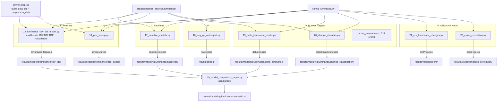

# Documento de Diseño: Validación del Pipeline EEG-Luminancia

## Overview

Este diseño cubre cinco áreas de validación y mejora del pipeline de predicción de luminancia desde EEG para sub-27, organizadas en orden lógico de ejecución:

1. **QA EEG** (script 16): Control de calidad con `autoreject` para cuantificar limpieza de señal.
2. **Baselines** (script 17): Modelos nulos (shuffle y media) para establecer nivel de azar.
3. **Features optimizados** (modificación script 13): Pipeline TDE basado en GLHMM (Vidaurre et al., 2025) con covarianza completa reemplazando mean+variance, y barrido PCA (script 18).
4. **Nuevos targets y métricas** (scripts 19, 20): R² en todos los modelos, evaluación z-score vs bruta, delta luminancia, clasificación cambio/estabilidad.
5. **Validación neurofisiológica** (scripts 21, 22): ERPs en cambios de luminancia y correlación cruzada luminancia real vs percibida.

El pipeline TDE sigue el protocolo TDE-GLHMM descrito en:
- **Paper**: Vidaurre et al. (2025). "A protocol for time-delay embedded hidden Markov modelling of brain data." *Nature Protocols*. https://www.nature.com/articles/s41596-025-01300-2
- **Librería**: GLHMM https://github.com/vidaurre/glhmm (ya en `environment.yml`)
- **Protocolo**: https://github.com/Nick7900/glhmm_protocols

En nuestro caso, se reutiliza la parte de preprocesamiento del pipeline TDE-GLHMM (`build_data_tde` + `preprocess_data` con PCA), pero en lugar de aplicar GLHMM como modelo, se usa Ridge regression con LOVO-CV.

Todos los scripts reutilizan la infraestructura existente: `config_luminance.py`, módulos en `src/campeones_analysis/luminance/`, y patrones de LOVO_CV + GridSearchCV de scripts 10–13.

## Architecture



## Components and Interfaces

### Nuevos módulos en `src/campeones_analysis/luminance/`

| Módulo | Función | Input | Output | Descripción |
|---|---|---|---|---|
| `qa.py` | `run_autoreject_qa` | `mne.io.Raw, events_df, roi_channels, epoch_params` | `dict` con stats de rechazo | Aplica `autoreject.AutoReject` sobre épocas EEG, retorna estadísticas de rechazo por canal/época |
| `qa.py` | `plot_rejection_heatmap` | `reject_log, channel_names, output_path` | Guarda PNG | Genera heatmap canales × épocas del patrón de rechazo |
| `features.py` | `compute_epoch_covariance` | `pca_epoch: np.ndarray (n_samples, n_components)` | `np.ndarray (n_features,)` | Computa covarianza completa, extrae triángulo superior aplanado |
| `tde_glhmm.py` | `apply_glhmm_tde_pipeline` | `eeg_data: np.ndarray, sfreq: float, tde_lags: int, pca_components: int` | `np.ndarray` | Wrapper que aplica `glhmm.preproc.build_data_tde()` + `glhmm.preproc.preprocess_data()` (estandarización + PCA) sobre señal EEG continua, siguiendo el protocolo de Vidaurre et al. (2025) |
| `targets.py` | `compute_delta_luminance` | `epoch_entries: list[dict]` | `list[dict]` | Calcula ΔL = L_i − L_{i-1}, descarta primera época por segmento |
| `targets.py` | `compute_change_labels` | `epoch_entries: list[dict], threshold: float` | `list[dict]` | Genera target binario (1=cambio, 0=constante) basado en |ΔL| > threshold |
| `evaluation.py` | `compute_r2_score` | `y_true, y_pred` | `float` | Calcula R² (coeficiente de determinación) |

### Nuevos scripts

| Script | Propósito | Requisitos |
|---|---|---|
| `scripts/qa/16_eeg_qa_autoreject.py` | QA con autoreject | 1.1–1.6 |
| `scripts/modeling/17_baseline_models.py` | Shuffle + Mean baselines, evaluación z-score vs bruta | 2.1–2.5, 3.1–3.4, 7b.1–7b.5 |
| `scripts/modeling/18_pca_sweep.py` | Varianza explicada PCA + curva rendimiento Ridge | 5.1–5.4, 5b.1–5b.3 |
| `scripts/modeling/19_delta_luminance_model.py` | Predicción de ΔL | 8.1–8.6 |
| `scripts/modeling/20_change_classifier.py` | Clasificación cambio/estabilidad | 9.1–9.6 |
| `scripts/validation/21_erp_luminance_changes.py` | ERPs en cambios de luminancia | 10.1–10.6 |
| `scripts/validation/22_cross_correlation.py` | Correlación cruzada real vs percibida | 11.1–11.5 |

### Modificaciones a código existente

| Archivo | Cambio | Requisitos |
|---|---|---|
| `scripts/modeling/13_luminance_raw_tde_model.py` | Reemplazar TDE custom + mean+var por pipeline GLHMM (`build_data_tde` + `preprocess_data`) + `compute_epoch_covariance` | 4.1–4.6 |
| `scripts/modeling/config_luminance.py` | Agregar `ACTIVE_MODELS`, `TARGET_ZSCORE`, `DELTA_ZSCORE`, `CHANGE_THRESHOLD`, `ERP_N_CHANGES`, `ERP_TMIN`, `ERP_TMAX` | 6.3, 7b.5, 8.4, 9.6, 10.1–10.2 |
| `scripts/reporting/15_model_comparison_report.py` | Extender con R², nuevos modelos, clasificador | 7.1–7.4, 12.1–12.6 |
| `src/campeones_analysis/luminance/__init__.py` | Exportar nuevas funciones públicas | — |

### Detalle de funciones clave

#### `apply_glhmm_tde_pipeline` (nuevo, reemplaza TDE custom)

```python
def apply_glhmm_tde_pipeline(
    eeg_data: np.ndarray,
    indices: np.ndarray,
    tde_lags: int,
    pca_components: int,
) -> np.ndarray:
    """Apply GLHMM TDE preprocessing pipeline on continuous EEG data.

    Follows the TDE-GLHMM protocol from Vidaurre et al. (2025, Nature Protocols):
    1. Apply Time-Delay Embedding via glhmm.preproc.build_data_tde()
    2. Standardize and reduce with PCA via glhmm.preproc.preprocess_data()

    This replaces the custom apply_tde_on_continuous_signal + sklearn PCA
    approach in the original script 13.

    Args:
        eeg_data: 2-D array of shape (n_timepoints, n_channels) with
            continuous EEG signal from ROI channels.
        indices: 2-D array of shape (n_sessions, 2) with start/end indices
            for each session/segment, as required by glhmm.preproc.
        tde_lags: Number of lags for TDE embedding (e.g., 10 for ±10 lags).
        pca_components: Number of PCA components to retain.

    Returns:
        2-D array of shape (n_valid_timepoints, pca_components) with
        TDE-embedded, standardized, PCA-reduced time-series.

    References:
        Vidaurre et al. (2025). A protocol for time-delay embedded hidden
        Markov modelling of brain data. Nature Protocols.
        https://doi.org/10.1038/s41596-025-01300-2
    """
```

#### `compute_epoch_covariance` (reemplaza mean+variance)

```python
def compute_epoch_covariance(
    pca_epoch: np.ndarray,
) -> np.ndarray:
    """Compute full covariance matrix of PCA components and extract upper triangle.

    Captures phase coherence and lag relationships between PCA components
    within an epoch window. The upper triangle (including diagonal) is
    flattened into a 1-D feature vector.

    Args:
        pca_epoch: 2-D array of shape (n_samples_in_epoch, n_components)
            containing PCA time-series for one epoch.

    Returns:
        1-D array of shape (n_components * (n_components + 1) // 2,)
        containing the upper triangle of the covariance matrix.
    """
```

Para n_components=50: vector de 50×51/2 = 1275 features (vs 100 con mean+var).

#### `compute_delta_luminance`

```python
def compute_delta_luminance(
    epoch_entries: list[dict],
    video_key: str = "video_identifier",
    target_key: str = "y",
) -> list[dict]:
    """Compute delta luminance target (y_i = L_i - L_{i-1}) per video segment.

    Discards the first epoch of each video segment (no previous epoch).

    Args:
        epoch_entries: List of epoch dicts with target values.
        video_key: Key to group epochs by video.
        target_key: Key containing the luminance target.

    Returns:
        New list of epoch dicts with target_key replaced by delta values.
        First epoch of each video group is excluded.
    """
```

#### `compute_change_labels`

```python
def compute_change_labels(
    epoch_entries: list[dict],
    threshold: float,
    video_key: str = "video_identifier",
    target_key: str = "y",
) -> list[dict]:
    """Generate binary change/stability labels from delta luminance.

    Args:
        epoch_entries: List of epoch dicts (should already have delta targets).
        threshold: Absolute delta threshold above which an epoch is labeled
            as 'change' (1), otherwise 'stable' (0).
        video_key: Key to group epochs by video.
        target_key: Key containing the delta luminance target.

    Returns:
        New list of epoch dicts with target_key replaced by binary labels (0 or 1).
    """
```

### Config additions

```python
# --- Nuevos parámetros en config_luminance.py ---

# Modelos activos para comparación (Req 6.3)
ACTIVE_MODELS: list[str] = ["base", "raw_tde", "raw_tde_cov", "shuffle_baseline",
                             "mean_baseline", "delta_luminance", "change_classifier"]

# Target normalization (Req 7b.5)
TARGET_ZSCORE: bool = False  # Default: luminancia bruta (0-255)

# Delta luminance (Req 8.4)
DELTA_ZSCORE: bool = False  # Default: delta bruto

# Change classifier (Req 9.6)
CHANGE_THRESHOLD: float = 5.0  # Umbral absoluto de delta luminancia

# ERP Analysis (Req 10.1, 10.2)
ERP_N_CHANGES: int = 50  # Top N momentos de cambio por video
ERP_TMIN: float = -0.2   # Ventana pre-cambio (segundos)
ERP_TMAX: float = 0.8    # Ventana post-cambio (segundos)

# Shuffle baseline (Req 2.5)
N_SHUFFLE_ITERATIONS: int = 100
```

## Data Models

### Epoch Entry (extendido, compatible con todos los modelos)

```python
{
    "X": np.ndarray,          # Feature vector (1-D)
    "y": float,               # Target: luminancia bruta, delta, o label binario
    "video_id": int,          # Video ID (3, 7, 9, 12)
    "video_identifier": str,  # "{video_id}_{acq}"
    "run_id": str,            # Run ID
    "acq": str,               # Acquisition ("a" o "b")
}
```

### QA Results Schema

| Columna | Tipo | Descripción |
|---|---|---|
| Subject | str | ID del sujeto |
| RunID | str | ID del run |
| Acq | str | Adquisición |
| VideoID | int | ID del video |
| TotalEpochs | int | Épocas totales |
| RejectedEpochs | int | Épocas rechazadas |
| RejectionPct | float | Porcentaje de rechazo |

### Baseline Results Schema

| Columna | Tipo | Descripción |
|---|---|---|
| Subject | str | ID del sujeto |
| Model | str | "shuffle_baseline" o "mean_baseline" |
| TestVideo | str | Video de test |
| R2 | float | Coeficiente de determinación |
| PearsonR | float | Correlación Pearson |
| SpearmanRho | float | Correlación Spearman |
| RMSE | float | Error cuadrático medio |

### Classification Results Schema

| Columna | Tipo | Descripción |
|---|---|---|
| Subject | str | ID del sujeto |
| TestVideo | str | Video de test |
| Accuracy | float | Exactitud |
| Precision | float | Precisión |
| Recall | float | Sensibilidad |
| F1 | float | F1-score |
| AUC_ROC | float | Área bajo curva ROC |

### Cross-Correlation Results Schema

| Columna | Tipo | Descripción |
|---|---|---|
| Subject | str | ID del sujeto |
| VideoID | int | ID del video |
| OptimalLag_s | float | Lag óptimo en segundos |
| MaxCorrelation | float | Correlación máxima |

### Decisiones de diseño clave

1. **Pipeline TDE basado en GLHMM**: En lugar de la implementación custom de TDE (`apply_time_delay_embedding` + sklearn PCA), se adopta el pipeline de preprocesamiento de la librería GLHMM (Vidaurre et al., 2025): `build_data_tde()` para el embedding temporal y `preprocess_data()` para estandarización + PCA. Esto sigue el protocolo establecido en Nature Protocols y garantiza consistencia con la literatura. Solo se reemplaza el modelo final (GLHMM → Ridge regression).

2. **Covarianza reemplaza mean+variance**: La covarianza completa captura relaciones entre componentes PCA (coherencia de fase, correlaciones cruzadas de lag) que mean+variance ignora. Para n_components=50, produce 1275 features vs 100, pero Ridge maneja bien alta dimensionalidad con regularización.

3. **Luminancia bruta por defecto**: Los valores originales (0–255) preservan la escala física del estímulo. El z-score se evalúa empíricamente como alternativa configurable.

4. **Script 12 se mantiene pero se excluye de comparaciones**: No se elimina del repositorio (referencia histórica), pero `ACTIVE_MODELS` lo excluye del reporte.

5. **Undersampling para clasificación**: Las épocas "constantes" dominan sobre "cambio". Se aplica undersampling aleatorio en el conjunto de entrenamiento de cada fold para equilibrar clases, preservando el test set intacto.

6. **ERPs con MNE nativo**: Se usa `mne.Epochs` directamente para crear épocas centradas en cambios de luminancia, aprovechando las funciones de promediado y topomap de MNE.

## Correctness Properties

*A property is a characteristic or behavior that should hold true across all valid executions of a system — essentially, a formal statement about what the system should do. Properties serve as the bridge between human-readable specifications and machine-verifiable correctness guarantees.*

Las siguientes propiedades fueron derivadas del análisis de prework sobre los criterios de aceptación. Se consolidaron propiedades redundantes (4.1+4.2+4.3 → Property 2, 8.1+8.2 → Property 5, 11.1+11.2 → Property 9) y se excluyeron criterios ya cubiertos por tests existentes (shuffle multisets, null distribution length).

### Property 1: Rejection percentage calculation

El prework 1.2 identifica que dado un reject_log con N épocas totales y M rechazadas, el porcentaje debe ser exactamente M/N × 100. Esto es una propiedad aritmética que debe cumplirse para cualquier combinación válida de N y M.

*For any* reject log with N total epochs (N > 0) and M rejected epochs (0 ≤ M ≤ N), the computed rejection percentage should equal M / N × 100.

**Validates: Requirements 1.2**

### Property 2: Covariance feature extraction shape and content

El prework 4.1+4.2+4.3 identifica que la extracción de covarianza debe producir un vector de longitud correcta con contenido consistente con la matriz de covarianza. Se consolidan los tres criterios en una sola propiedad.

*For any* PCA epoch matrix of shape (n_samples, n_components) where n_samples ≥ 2 and n_components ≥ 1, `compute_epoch_covariance` should return a 1-D vector of length n_components × (n_components + 1) / 2, and the values should match the upper triangle (including diagonal) of `np.cov(epoch.T)`.

**Validates: Requirements 4.1, 4.2, 4.3**

### Property 3: Mean baseline prediction equals training mean

El prework 3.1+3.2 identifica que el mean baseline debe predecir exactamente la media aritmética del conjunto de entrenamiento para todas las épocas de test.

*For any* set of training target values and any set of test epochs, the mean baseline model should produce predictions where every predicted value equals the arithmetic mean of the training targets.

**Validates: Requirements 3.1, 3.2**

### Property 4: Cumulative PCA explained variance is monotonically non-decreasing

El prework 5.2 identifica que la varianza explicada acumulada de PCA debe ser monótonamente no-decreciente y acotada en [0, 1].

*For any* data matrix with more than one sample, the cumulative explained variance ratio from PCA should be monotonically non-decreasing, with each value in [0, 1], and the final value should equal 1.0 (within floating-point tolerance) when all components are retained.

**Validates: Requirements 5.2**

### Property 5: Delta luminance computation and first-epoch discard

El prework 8.1+8.2 identifica que el delta se computa como diferencia consecutiva y la primera época de cada video se descarta. Se consolidan en una propiedad.

*For any* list of epoch entries grouped by video, `compute_delta_luminance` should return a list with exactly one fewer epoch per video group, where each remaining epoch's target equals L_i − L_{i-1} (the difference between consecutive original targets within the same video).

**Validates: Requirements 8.1, 8.2**

### Property 6: R² calculation matches sklearn

El prework 7.1 identifica que el cálculo de R² debe ser consistente con la implementación de referencia.

*For any* pair of y_true and y_pred arrays of equal length (length ≥ 2) with non-constant y_true, `compute_r2_score(y_true, y_pred)` should equal `sklearn.metrics.r2_score(y_true, y_pred)` within floating-point tolerance.

**Validates: Requirements 7.1**

### Property 7: Binary change labels from threshold

El prework 9.1 identifica que las etiquetas binarias deben asignarse correctamente según el umbral.

*For any* list of epoch entries with delta luminance targets and any threshold > 0, `compute_change_labels` should assign label 1 to epochs where |delta| > threshold and label 0 otherwise, preserving all other epoch fields unchanged.

**Validates: Requirements 9.1**

### Property 8: Top N luminance changes detection

El prework 10.1 identifica que la detección de cambios debe retornar exactamente los N índices con mayor cambio absoluto.

*For any* luminance time series of length L (L > N) and any N ≥ 1, the detected change indices should correspond to the N time-points with the largest absolute first-difference values, sorted by magnitude descending.

**Validates: Requirements 10.1**

### Property 9: Cross-correlation bounds and lag detection

El prework 11.1+11.2 identifica que la correlación cruzada normalizada debe estar acotada y detectar correctamente el lag de una señal desplazada conocida.

*For any* two non-zero signals of equal length, the normalized cross-correlation values should be in [-1, 1]. Additionally, for any signal and a known shifted copy (shift by k samples), the detected optimal lag should equal k.

**Validates: Requirements 11.1, 11.2**

### Property 10: Undersampling produces balanced classes

El prework 9.2 identifica que el undersampling debe equilibrar las clases en el conjunto de entrenamiento.

*For any* set of binary-labeled training epochs where both classes are present, after undersampling the majority class, the count of class 0 and class 1 should be equal (matching the minority class count).

**Validates: Requirements 9.2**

## Error Handling

| Escenario | Manejo |
|---|---|
| Archivo EEG no encontrado para un run | Log warning, skip run, continuar con los demás |
| Events TSV no encontrado | Log warning, skip run |
| Order Matrix no encontrado | Log warning, skip run |
| Segmento de video demasiado corto para TDE + epoching | Log warning, skip segmento |
| Luminance CSV no encontrado | Log warning, skip segmento |
| No se generan épocas en ningún run | Print error, exit gracefully |
| Señal de joystick no disponible para un video | Log warning, omitir video (Req 11.5) |
| Dimensión sin datos en exploración | Log warning, skip histograma |
| PCA n_components > min(n_rows, n_cols) | Reducir automáticamente a min(n_rows, n_cols) |
| Video con std=0 en luminancia | zscore_per_video asigna 0.0, log warning |
| Clasificador con una sola clase en fold | Log warning, reportar métricas como NaN para ese fold |
| autoreject falla en un run | Log warning, skip run, continuar con los demás |

## Testing Strategy

### Enfoque dual de testing

- **Property-based tests** (Hypothesis): Verifican propiedades universales con inputs generados aleatoriamente. Mínimo 100 iteraciones por propiedad.
- **Unit tests** (pytest): Verifican ejemplos específicos, edge cases y condiciones de error.

### Configuración de Property-Based Testing

- Librería: **Hypothesis** (ya en `environment.yml`)
- Cada test de propiedad ejecuta mínimo 100 ejemplos
- Cada test se etiqueta con: `Feature: eeg-luminance-validation, Property {N}: {título}`
- Cada propiedad de correctness se implementa como exactamente un test de propiedad

### Organización de archivos de test

| Archivo | Cubre |
|---|---|
| `tests/test_eeg_qa.py` | Property 1 (rejection percentage) |
| `tests/test_covariance_features.py` | Property 2 (covariance extraction) |
| `tests/test_baseline_models.py` | Property 3 (mean baseline) |
| `tests/test_pca_sweep.py` | Property 4 (cumulative variance) |
| `tests/test_delta_luminance.py` | Properties 5, 7 (delta computation, change labels) |
| `tests/test_evaluation_metrics.py` | Property 6 (R² calculation) |
| `tests/test_erp_analysis.py` | Property 8 (top N changes) |
| `tests/test_cross_correlation.py` | Property 9 (xcorr bounds + lag) |
| `tests/test_class_balancing.py` | Property 10 (undersampling balance) |

### Foco de Unit Tests

- Assertions de valores de config (ACTIVE_MODELS, TARGET_ZSCORE, DELTA_ZSCORE, CHANGE_THRESHOLD)
- Edge cases: video con luminancia constante, fold con una sola clase, señal vacía
- Formato de output: columnas correctas en CSVs de resultados
- Integración: epoch entries tienen todas las keys requeridas
