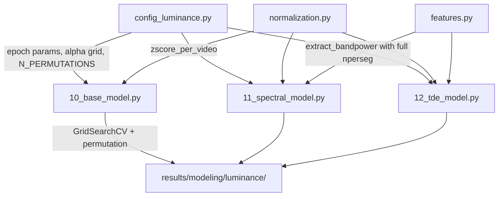

# Design Document: Luminance Model Improvements

## Overview

This design describes four targeted improvements to the existing EEG luminance prediction pipeline (scripts 10–12) for sub-27. The improvements address known weaknesses: poor spectral resolution from short epochs, scale bias from unnormalized luminance targets across videos, a fixed regularization parameter, and lack of statistical significance testing.

All changes modify the existing codebase in-place. The shared config module (`config_luminance.py`) gains new parameters, the reusable feature module (`features.py`) gets an updated `nperseg` strategy, a new `normalization.py` module provides z-score logic, and each model script (10, 11, 12) is updated to use normalization, grid search, and permutation testing.

## Architecture

The existing architecture is preserved: config → reusable modules → model scripts → results. The changes are layered on top:



### Change Summary

1. **Config changes**: `EPOCH_DURATION_S=1.0`, `EPOCH_OVERLAP_S=0.9`, new `RIDGE_ALPHA_GRID`, `N_PERMUTATIONS=100`
2. **New module**: `src/campeones_analysis/luminance/normalization.py` with `zscore_per_video()`
3. **features.py update**: `extract_bandpower` uses `nperseg=n_samples` (full epoch length) instead of `min(n_samples, 256)`
4. **Model scripts update**: integrate normalization, replace fixed Ridge with `GridSearchCV`, add permutation test function

## Components and Interfaces

### 1. Config Updates (`scripts/modeling/config_luminance.py`)

```python
# Epoch windowing — updated
EPOCH_DURATION_S: float = 1.0      # was 0.5
EPOCH_OVERLAP_S: float = 0.9       # was 0.4
EPOCH_STEP_S: float = 0.1          # unchanged

# ML pipeline — new grid
RIDGE_ALPHA_GRID: list[float] = [0.01, 0.1, 1.0, 10.0, 100.0]
RIDGE_ALPHA: float = 1.0           # retained as fallback

# Permutation test
N_PERMUTATIONS: int = 100
```

### 2. Z-Score Normalization Module (`src/campeones_analysis/luminance/normalization.py`)

```python
def zscore_per_video(
    epoch_entries: list[dict],
    video_key: str = "video_identifier",
    target_key: str = "y",
) -> list[dict]:
    """Normalize target values to zero mean, unit variance within each video group.

    Args:
        epoch_entries: List of epoch dicts, each containing at minimum
            the keys specified by video_key and target_key.
        video_key: Key used to group epochs by video.
        target_key: Key containing the luminance target value.

    Returns:
        New list of epoch dicts with target_key replaced by the z-scored value.
        If a video group has std == 0, all targets in that group are set to 0.0.
    """
```

This is a pure function: it takes epoch entries and returns new epoch entries with normalized targets. No side effects, no I/O.

### 3. Updated Band-Power Extraction (`src/campeones_analysis/luminance/features.py`)

The `extract_bandpower` function currently uses `nperseg=min(n_samples, 256)`. With 1-second epochs at 500 Hz, `n_samples=500`, so the current cap at 256 limits resolution to ~2 Hz. The fix removes the cap:

```python
# Current:  nperseg=min(eeg_epoch.shape[1], 256)
# Updated:  nperseg=eeg_epoch.shape[1]
```

This gives `nperseg=500` → Δf = 500/500 = 1 Hz, enabling proper separation of delta (1–4 Hz), theta (4–8 Hz), and alpha (8–13 Hz).

### 4. Grid Search Integration (in model scripts)

Replace the fixed `Ridge(alpha=RIDGE_ALPHA)` with `GridSearchCV` wrapping Ridge inside the existing `make_pipeline`:

```python
from sklearn.model_selection import GridSearchCV

# Inside each fold of LOVO_CV:
pipeline = make_pipeline(
    StandardScaler(),
    PCA(n_components=pca_components, random_state=RANDOM_SEED),
    Ridge(random_state=RANDOM_SEED),
)

grid_search = GridSearchCV(
    pipeline,
    param_grid={"ridge__alpha": RIDGE_ALPHA_GRID},
    cv=3,  # inner 3-fold CV
    scoring="neg_mean_squared_error",
    refit=True,
)
grid_search.fit(X_train, y_train)
y_pred = grid_search.predict(X_test)
best_alpha = grid_search.best_params_["ridge__alpha"]
```

### 5. Permutation Test Function

A new reusable function in `src/campeones_analysis/luminance/permutation.py`:

```python
def run_permutation_test(
    epoch_entries: list[dict],
    build_and_evaluate_fn: Callable[[list[dict]], float],
    n_permutations: int,
    random_seed: int,
    video_key: str = "video_identifier",
    target_key: str = "y",
) -> dict:
    """Run a permutation test by shuffling targets within each video group.

    Args:
        epoch_entries: The full list of epoch dicts.
        build_and_evaluate_fn: A callable that takes epoch_entries and returns
            the mean Pearson r across LOVO_CV folds.
        n_permutations: Number of permutation iterations.
        random_seed: Base seed for reproducibility.
        video_key: Key to group epochs by video.
        target_key: Key containing the target value to shuffle.

    Returns:
        Dict with keys: null_distribution (1-D array of length n_permutations),
        observed_r (float), p_value (float).
    """
```

A companion plotting function:

```python
def plot_permutation_histogram(
    null_distribution: np.ndarray,
    observed_r: float,
    p_value: float,
    output_path: Path,
) -> None:
    """Save a histogram of the null distribution with observed r marked."""
```

### 6. Model Script Updates (10, 11, 12)

Each model script's `run_pipeline()` function is updated to:
1. Call `zscore_per_video()` on collected epoch entries before CV
2. Replace fixed Ridge with `GridSearchCV` in each fold
3. Log the best alpha per fold in the results DataFrame
4. After CV, call `run_permutation_test()` and save results + plot

## Data Models

### Epoch Entry Dict (existing, unchanged structure)

```python
{
    "X": np.ndarray,           # feature vector (1-D)
    "y": float,                # luminance target (now z-scored)
    "video_id": int,           # video number (3, 7, 9, 12)
    "video_identifier": str,   # e.g. "3_a"
    "run_id": str,             # e.g. "002"
    "acq": str,                # "a" or "b"
}
```

### Results DataFrame (extended)

Existing columns preserved, new column added:

| Column | Type | Description |
|--------|------|-------------|
| Subject | str | Subject ID |
| Acq | str | Acquisition label |
| Model | str | Model type (base/spectral/tde) |
| TestVideo | str | Test video identifier |
| TrainSize | int | Number of training epochs |
| TestSize | int | Number of test epochs |
| PearsonR | float | Pearson correlation |
| SpearmanRho | float | Spearman correlation |
| RMSE | float | Root mean squared error |
| BestAlpha | float | **NEW** — Selected Ridge alpha from grid search |

### Permutation Results Dict

```python
{
    "null_distribution": np.ndarray,  # shape (n_permutations,)
    "observed_r": float,
    "p_value": float,
}
```


## Correctness Properties

*A property is a characteristic or behavior that should hold true across all valid executions of a system — essentially, a formal statement about what the system should do. Properties serve as the bridge between human-readable specifications and machine-verifiable correctness guarantees.*

The following properties were derived from the acceptance criteria via prework analysis. Redundant criteria (2.2/2.4 consolidated, 4.2/4.3 consolidated) were merged. Edge cases (2.3: zero-std video) are handled within the generators rather than as separate properties.

### Property 1: Spectral resolution matches epoch length

*For any* EEG epoch of shape `(n_channels, n_samples)` with `n_samples >= 2` and any sampling frequency, calling `extract_bandpower` should use `nperseg = n_samples`, resulting in a frequency resolution of `Δf = sfreq / n_samples`. The returned band-power vector should have shape `(n_channels * n_bands,)` with all values ≥ 0.

**Validates: Requirements 1.4**

### Property 2: Z-score normalization produces zero mean and unit variance per video

*For any* list of epoch entries containing at least two distinct target values per video group, after applying `zscore_per_video`, the targets within each video group should have mean ≈ 0.0 (within floating-point tolerance) and standard deviation ≈ 1.0. The number of epoch entries should be unchanged. Edge case: if a video group has constant targets (std=0), all normalized values should be 0.0.

**Validates: Requirements 2.2, 2.3, 2.4**

### Property 3: Grid search selects alpha from the configured grid

*For any* training feature matrix and target vector with sufficient samples, after running `GridSearchCV` with `RIDGE_ALPHA_GRID`, the selected `best_params_["ridge__alpha"]` should be a member of `RIDGE_ALPHA_GRID`.

**Validates: Requirements 3.2**

### Property 4: Permutation shuffle preserves within-video target multisets and features

*For any* list of epoch entries with multiple video groups, after shuffling targets within each video group, the multiset of target values within each video group should be identical to the original, and all feature vectors (`X`) should be unchanged (element-wise equal).

**Validates: Requirements 4.2, 4.3**

### Property 5: Null distribution has correct length

*For any* positive integer `n_permutations`, the permutation test should produce a null distribution array of exactly `n_permutations` elements.

**Validates: Requirements 4.4**

### Property 6: P-value equals proportion of null values ≥ observed

*For any* 1-D array of null distribution values and any observed value, the p-value should equal `count(null_distribution >= observed_r) / len(null_distribution)`. When observed_r is greater than all null values, p-value should be 0.0. When observed_r is less than or equal to all null values, p-value should be 1.0.

**Validates: Requirements 4.5**

## Error Handling

| Scenario | Handling |
|----------|----------|
| Video segment with zero-std luminance | `zscore_per_video` sets all targets to 0.0, logs a warning |
| Epoch too short for Welch PSD | `extract_bandpower` uses `nperseg=n_samples` which is always valid for `n_samples >= 2` |
| GridSearchCV fails to converge | scikit-learn raises; caught at pipeline level with warning, falls back to `RIDGE_ALPHA` |
| Permutation test with 0 permutations | Return empty null distribution, p-value = NaN, log warning |
| Empty epoch list passed to normalization | Return empty list unchanged |

## Testing Strategy

### Dual Testing Approach

- **Property-based tests** (Hypothesis): Verify universal correctness properties across randomly generated inputs. Minimum 100 iterations per property.
- **Unit tests** (pytest): Verify specific examples, edge cases, config values, and integration points.

### Property-Based Testing Configuration

- Library: **Hypothesis** (already in `environment.yml`)
- Each property test runs minimum 100 examples
- Each test is tagged with: `Feature: luminance-model-improvements, Property {N}: {title}`
- Each correctness property maps to exactly one property-based test

### Test File Organization

| Test file | Covers |
|-----------|--------|
| `tests/test_luminance_features.py` | Property 1 (updated existing bandpower test) |
| `tests/test_luminance_normalization.py` | Property 2 (new) |
| `tests/test_luminance_permutation.py` | Properties 4, 5, 6 (new) |
| `tests/test_luminance_pipeline.py` | Property 3 (grid search, added to existing) |

### Unit Test Focus

- Config value assertions (Req 1.1–1.3, 3.1, 3.5, 4.1)
- Results DataFrame contains `BestAlpha` column (Req 3.4)
- Edge case: zero-std video normalization (Req 2.3)
- Edge case: empty epoch list normalization
