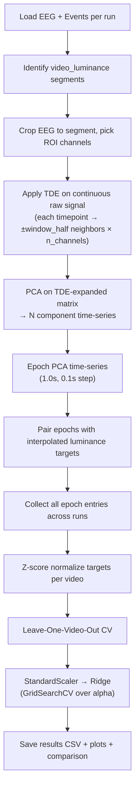
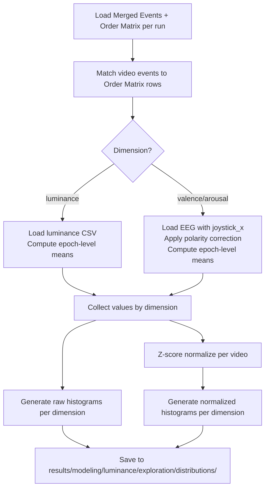

# Design Document: Raw TDE and Exploratory Analysis

## Overview

This design covers two additions to the luminance prediction pipeline:

1. **Script 13 — Raw TDE Model** (`scripts/modeling/13_luminance_raw_tde_model.py`): A new pipeline that bypasses spectral feature extraction. Instead, it applies Time-Delay Embedding directly on the continuous preprocessed raw EEG signal from ROI channels, then uses PCA to reduce the TDE-expanded features to N principal component time-series, epochs those time-series, and fits Ridge regression via LOVO-CV. This approach preserves the full temporal waveform information that spectral band-power discards.

2. **Script 14 — Distribution Explorer** (`scripts/modeling/14_explore_target_distributions.py`): An exploratory script that loads joystick and luminance data across all runs, groups them by dimension (valence, arousal, luminance), and generates distribution histograms for both raw and z-score-normalized-per-video values.

Both scripts reuse the shared config (`config_luminance.py`), existing reusable modules in `src/campeones_analysis/luminance/`, and follow the same patterns as scripts 10–12.

## Architecture

### Script 13 — Raw TDE Model Pipeline



### Script 14 — Distribution Explorer Pipeline



## Components and Interfaces

### Script 13 — New Functions

| Function | Input | Output | Description |
|---|---|---|---|
| `apply_tde_on_continuous_signal` | `eeg_data: np.ndarray (n_channels × n_samples)`, `window_half: int` | `np.ndarray (n_valid × n_channels × window_size)` | Applies TDE on the continuous raw EEG, producing a matrix where each valid time-point has a flattened vector of [t-wh, ..., t+wh] × channels. Discards border points. |
| `extract_raw_tde_epochs_for_run` | `run_config, eeg_raw, events_df, roi_channels` | `list[dict]` | For each video_luminance segment: crops EEG, applies TDE on continuous signal, applies PCA, epochs the PCA time-series, pairs with luminance targets. Returns epoch entries. |
| `plot_cv_results` | `results_df, output_dir` | Saves PNG | Bar plot of per-fold metrics (reuses pattern from script 12). |
| `plot_predictions_per_fold` | `fold_predictions, output_dir` | Saves PNG | Scatter plots of y_true vs y_pred per fold. |
| `plot_comparison_with_spectral_tde` | `results_df, output_dir` | Saves PNG | Side-by-side comparison with script 12 results. |
| `run_pipeline` | None | None | Orchestrates the full pipeline. |

### Script 13 — Reused Functions (from existing modules)

| Function | Module | Purpose |
|---|---|---|
| `apply_time_delay_embedding` | `campeones_analysis.luminance.features` | Core TDE logic (used internally by `apply_tde_on_continuous_signal` on the transposed signal matrix). |
| `zscore_per_video` | `campeones_analysis.luminance.normalization` | Z-score normalization of targets per video group. |
| `load_luminance_csv` | `campeones_analysis.luminance.sync` | Load and validate luminance CSV. |
| `create_epoch_onsets` | `campeones_analysis.luminance.sync` | Generate epoch onset times. |
| `interpolate_luminance_to_epochs` | `campeones_analysis.luminance.sync` | Interpolate luminance targets to epoch windows. |
| `run_permutation_test` | `campeones_analysis.luminance.permutation` | Permutation testing. |
| `select_roi_channels` | Defined in script (same as scripts 10–12) | Filter ROI channels present in recording. |
| `leave_one_video_out_split` | Defined in script (same as scripts 10–12) | LOVO-CV fold generation. |
| `evaluate_fold` | Defined in script (same as scripts 10–12) | Compute PearsonR, SpearmanRho, RMSE. |

### Script 14 — Functions

| Function | Input | Output | Description |
|---|---|---|---|
| `collect_dimension_values` | `runs_config, merged_events_path_fn, order_matrix_path_fn, eeg_path_fn` | `dict[str, list[dict]]` | Iterates all runs, matches video events to Order Matrix, extracts epoch-level values per dimension. |
| `plot_distribution` | `values, dimension_name, version ("raw"/"normalized"), output_dir` | Saves PNG | Generates a single histogram with descriptive stats annotation. |
| `run_pipeline` | None | None | Orchestrates loading, collection, normalization, and plotting. |

### Shared Config Additions

No changes to `config_luminance.py` are needed. The existing `TDE_WINDOW_HALF`, `TDE_PCA_COMPONENTS` (=50), `PCA_COMPONENTS` (=100), and all path/run configs are sufficient. Script 13 will use `PCA_COMPONENTS` for the number of PCA components after TDE on the raw signal.


## Data Models

### Epoch Entry (Script 13)

Same structure as scripts 10–12, ensuring compatibility with `zscore_per_video` and `leave_one_video_out_split`:

```python
{
    "X": np.ndarray,          # 1-D feature vector (flattened PCA epoch)
    "y": float,               # Interpolated luminance target
    "video_id": int,          # Video ID (3, 7, 9, or 12)
    "video_identifier": str,  # "{video_id}_{acq}" for unique grouping
    "run_id": str,            # Run ID ("002", "003", etc.)
    "acq": str,               # Acquisition ("a" or "b")
}
```

Feature vector dimensions for Script 13:
- After TDE on continuous signal: each valid time-point has `n_roi_channels × (2 × window_half + 1)` = 11 × 21 = 231 features
- After PCA: reduced to `PCA_COMPONENTS` (100) features per time-point
- After epoching: each epoch has `PCA_COMPONENTS × n_samples_per_epoch` = 100 × 500 = 50,000 features per epoch
- This is the `X` vector in each epoch entry

### Dimension Values (Script 14)

```python
{
    "value": float,              # Epoch-level mean (luminance or joystick)
    "video_id": int,             # Video ID
    "video_identifier": str,     # "{video_id}_{acq}"
    "dimension": str,            # "valence", "arousal", or "luminance"
    "run_id": str,               # Run ID
    "acq": str,                  # Acquisition
}
```

### Results CSV Schema (Script 13)

Same columns as script 12 results, with `Model` = `"raw_tde"`:

| Column | Type | Description |
|---|---|---|
| Subject | str | Subject ID |
| Acq | str | Acquisition label |
| Model | str | `"raw_tde"` |
| TestVideo | str | Video identifier for test fold |
| TrainSize | int | Number of training epochs |
| TestSize | int | Number of test epochs |
| PearsonR | float | Pearson correlation |
| SpearmanRho | float | Spearman correlation |
| RMSE | float | Root mean squared error |
| BestAlpha | float | Best Ridge alpha from GridSearchCV |

### Key Design Decision: TDE on Continuous Signal

The existing `apply_time_delay_embedding` function in `features.py` operates on a 2-D matrix `(n_epochs, n_features)`. For Script 13, we need to apply TDE on the continuous raw EEG signal, which is a matrix of shape `(n_channels, n_samples)`.

The approach:
1. Transpose the EEG data to `(n_samples, n_channels)` — each row is a time-point, each column is a channel
2. Call `apply_time_delay_embedding(transposed_eeg, window_half)` — this concatenates ±window_half neighboring time-points for each valid time-point
3. Result: `(n_valid_samples, n_channels × window_size)` — the TDE-expanded feature matrix
4. Apply PCA on this matrix to get `(n_valid_samples, n_components)`
5. Epoch the PCA-reduced matrix

This reuses the existing TDE function without modification, since it already handles the general case of concatenating neighboring rows in a 2-D matrix.

### Key Design Decision: Epoch Alignment After TDE Border Removal

TDE on the continuous signal discards `window_half` samples from each end. The epoch onsets must be computed relative to the valid region (after border removal), and the luminance interpolation must account for the time offset introduced by the border removal.

Specifically:
- Original segment starts at `t_start` (onset from events)
- After TDE, valid region starts at `t_start + window_half / sfreq`
- Epoch onsets are computed within the valid region
- Luminance interpolation uses `epoch_onset + border_offset` relative to video start


## Correctness Properties

*A property is a characteristic or behavior that should hold true across all valid executions of a system — essentially, a formal statement about what the system should do. Properties serve as the bridge between human-readable specifications and machine-verifiable correctness guarantees.*

### Property 1: TDE output shape invariant

From prework 1.2 + 1.3: TDE on the continuous signal should produce a matrix with exactly `n_samples - 2 * window_half` rows and `n_channels * (2 * window_half + 1)` columns. This validates both the correct expansion and the border discard.

*For any* EEG matrix of shape `(n_channels, n_samples)` where `n_samples >= 2 * window_half + 1`, and any `window_half >= 1`, applying TDE on the transposed matrix should produce an output of shape `(n_samples - 2 * window_half, n_channels * (2 * window_half + 1))`.

**Validates: Requirements 1.2, 1.3**

### Property 2: PCA preserves time-points and reduces features

From prework 1.4: PCA on the TDE-expanded matrix should preserve the number of time-points (rows) while reducing the feature dimension (columns) to at most N components.

*For any* TDE-expanded matrix of shape `(n_timepoints, n_features)` and any `n_components <= min(n_timepoints, n_features)`, applying PCA should produce a matrix of shape `(n_timepoints, n_components)`.

**Validates: Requirements 1.4**

### Property 3: Epoch count from PCA time-series

From prework 1.5: The number of epochs generated from a PCA time-series of known length should match the expected count given the epoch duration and step parameters.

*For any* PCA time-series of length `n_valid_samples` at sampling frequency `sfreq`, with epoch duration `epoch_duration_s` and step `epoch_step_s`, the number of epochs should equal `floor((n_valid_samples / sfreq - epoch_duration_s) / epoch_step_s) + 1` (when the segment is long enough for at least one epoch).

**Validates: Requirements 1.5**

### Property 4: Polarity correction is negation

From prework 4.3: When the Order Matrix specifies `polarity="inverse"`, the joystick signal should be negated. Applying polarity correction twice (inverse then inverse) should return the original signal.

*For any* joystick signal array and polarity "inverse", the corrected signal should equal the negation of the original. Applying correction with "inverse" polarity twice should be an identity operation (round-trip).

**Validates: Requirements 4.3**

## Error Handling

| Scenario | Handling |
|---|---|
| EEG file not found for a run | Log warning, skip run, continue with remaining runs |
| Events TSV not found for a run | Log warning, skip run |
| Order Matrix not found for a run | Log warning, skip run |
| Video segment too short for TDE + epoching | Log warning, skip segment (Req 1.7) |
| Luminance CSV not found for a video | Log warning, skip that video segment |
| No epochs generated across all runs | Print error message, exit gracefully |
| No data for a dimension in explorer | Log warning, skip histogram (Req 4.7) |
| PCA n_components > min(n_rows, n_cols) | Automatically reduce to min(n_rows, n_cols) |
| Joystick channel not present in EEG | Log warning, skip that video for joystick extraction |

## Testing Strategy

### Property-Based Tests (Hypothesis)

Each correctness property will be implemented as a property-based test using the `hypothesis` library (already in the environment). Tests will run a minimum of 100 iterations each.

- **Property 1** (TDE shape): Generate random EEG matrices with varying n_channels (1–15) and n_samples (50–2000), and window_half (1–20). Verify output shape.
- **Property 2** (PCA preserves rows): Generate random TDE-expanded matrices with varying dimensions. Verify PCA output shape.
- **Property 3** (Epoch count): Generate random segment lengths and verify epoch count formula.
- **Property 4** (Polarity negation): Generate random joystick arrays. Verify negation and round-trip.

Tag format: `Feature: raw-tde-and-exploratory-analysis, Property N: <title>`

### Unit Tests

Unit tests complement property tests for specific examples and edge cases:

- Edge case: segment exactly long enough for 1 epoch after TDE border removal
- Edge case: segment too short → returns empty list
- Edge case: dimension with no data → warning logged
- Example: verify CSV output has correct columns
- Example: verify epoch entries have all required keys

### Test File

All tests in `tests/test_raw_tde_model.py`.
