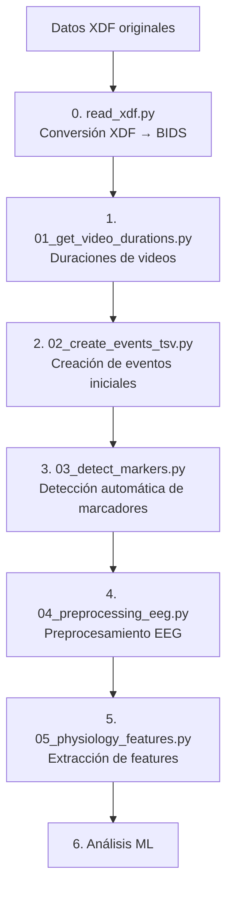

# CAMPEONES Analysis - Documentación Técnica

> Pipeline reproducible para análisis de datos de experimentos sobre emociones inmersivas (EEG + mediciones periféricas) con Python.

## Tabla de Contenidos

1. [Objetivo del Proyecto](#objetivo-del-proyecto)
2. [Arquitectura del Codebase](#arquitectura-del-codebase)
3. [Pipeline de Procesamiento](#pipeline-de-procesamiento)
4. [Arquitectura de Datos BIDS](#arquitectura-de-datos-bids)
5. [Scripts de Preprocesamiento](#scripts-de-preprocesamiento)
6. [Testing y Validación](#testing-y-validación)
7. [Troubleshooting](#troubleshooting)

---

## Objetivo del Proyecto

`campeones_analysis` es un proyecto Python para analizar datos de experimentos sobre emociones en contextos inmersivos, incluyendo EEG y mediciones fisiológicas periféricas (EDA, ECG, RESP). Proporciona un flujo de trabajo reproducible, modular y automatizado para:

- **Preprocesamiento** de señales EEG y fisiológicas
- **Extracción de características** multimodales
- **Machine Learning** para análisis de estados emocionales
- **Cumplimiento BIDS** para interoperabilidad y reproducibilidad

---

## Arquitectura del Codebase

### Estructura de Directorios

```
campeones_analysis/
├── src/campeones_analysis/          # Paquete importable (lógica científica)
│   ├── physio/                      # Lectura y procesamiento de señales
│   │   └── read_xdf.py             # Conversión XDF → BIDS
│   ├── behav/                       # Análisis comportamental
│   ├── models/                      # Modelos de ML
│   └── utils/                       # Utilidades compartidas
│
├── scripts/                         # Entrypoints y utilidades
│   ├── preprocessing/               # Scripts de preprocesamiento
│   ├── diagnostics/                 # Validación de datos
│   └── sanity_check/               # Verificación de calidad
│
├── tests/                          # Tests automatizados
│
├── data/                           # Datos (no versionados)
│   ├── sourcedata/                 # Datos originales (.xdf)
│   ├── raw/                        # Dataset BIDS raw (READ-ONLY)
│   └── derivatives/                # Resultados procesados
│       ├── events/                 # Eventos iniciales
│       ├── auto_events/            # Eventos detectados automáticamente
│       ├── merged_events/          # Eventos fusionados
│       └── features/               # Features extraídas
│
├── docs/                           # Documentación
├── environment.yml                 # Entorno reproducible
├── pyproject.toml                  # Configuración del paquete
└── README.md                       # Documentación principal
```

### Principios de Diseño

- **Separación de responsabilidades**: `src/` contiene lógica científica, `scripts/` contiene entrypoints
- **Inmutabilidad de datos raw**: `data/raw/` es READ-ONLY (nunca escribir con permisos `w`, `a`, `r+`)
- **BIDS compliance**: Todos los datos siguen el estándar BIDS 1.10
- **Reproducibilidad**: Entornos con micromamba, seeds determinísticos, versiones pinneadas

---

## Pipeline de Procesamiento

### 🚀 Quick Start: Orden de Ejecución

Para procesar datos de un nuevo sujeto, ejecutar los scripts en este orden:

```bash
# PASO 0: Convertir XDF a BIDS (OBLIGATORIO)
micromamba run -n campeones python -m src.campeones_analysis.physio.read_xdf --subject XX

# PASO 1: Obtener duraciones de videos (OPCIONAL, solo si no existe video_durations.csv)
micromamba run -n campeones python scripts/preprocessing/01_get_video_durations.py

# PASO 2: Crear eventos iniciales (run se detecta automáticamente)
micromamba run -n campeones python scripts/preprocessing/02_create_events_tsv.py --subjects XX --all-runs

# PASO 3: Detectar marcadores automáticamente
# Procesar TODAS las combinaciones para un sujeto (comportamiento por defecto)
micromamba run -n campeones python scripts/preprocessing/03_detect_markers.py --subject XX

# O filtrar por tarea específica
micromamba run -n campeones python scripts/preprocessing/03_detect_markers.py --subject XX --task YY

# O especificar combinación exacta
micromamba run -n campeones python scripts/preprocessing/03_detect_markers.py --subject XX --task YY --acq a

# PASO 4: Preprocesamiento EEG (run se detecta automáticamente)
micromamba run -n campeones python scripts/preprocessing/04_preprocessing_eeg.py --subject XX --session vr --task YY --acq a

# PASO 5: Extracción de features
micromamba run -n campeones python scripts/preprocessing/05_physiology_features.py --subject XX
```

**Nota**: 
- Los scripts están numerados (`01_`, `02_`, etc.) para indicar el orden de ejecución
- **El parámetro `--run` ya no es necesario** - se detecta automáticamente del archivo EEG
- La combinación `sub-XX_ses-YY_task-ZZ_acq-A` es única para cada archivo

---

### Flujo de Trabajo Completo



### Orden de Ejecución de Scripts

#### **Paso 1: Conversión XDF → BIDS** (OBLIGATORIO)

Convierte archivos `.xdf` originales a formato BrainVision (`.vhdr`) siguiendo BIDS.

```bash
# Procesar un sujeto específico
micromamba run -n campeones python -m src.campeones_analysis.physio.read_xdf --subject 18

# Procesar todos los sujetos
micromamba run -n campeones python -m src.campeones_analysis.physio.read_xdf
```

**Entrada**: `data/sourcedata/xdf/sub-XX/ses-VR/physio/*.xdf`  
**Salida**: `data/raw/sub-XX/ses-vr/eeg/*.vhdr` (+ metadatos BIDS)

---

#### **Paso 2: Obtener duraciones de videos** (OPCIONAL, si no existe)

**Script**: `scripts/preprocessing/01_get_video_durations.py`

Calcula duraciones precisas de estímulos visuales.

```bash
micromamba run -n campeones python scripts/preprocessing/01_get_video_durations.py
```

**Entrada**: `stimuli/*.mp4`  
**Salida**: `stimuli/video_durations.csv`

---

#### **Paso 3: Crear eventos iniciales**

**Script**: `scripts/preprocessing/02_create_events_tsv.py`

Genera archivos `events.tsv` a partir de planillas de orden experimental.

**NOTA IMPORTANTE**: El parámetro `--run` ya no es necesario. El script detecta automáticamente el número de run del archivo EEG basándose en la combinación única `sub-XX_ses-YY_task-ZZ_acq-A`.

```bash
# Procesar un sujeto y tarea específicos
micromamba run -n campeones python scripts/preprocessing/02_create_events_tsv.py --subjects 16 --task 02 --acq a

# Procesar todas las runs de un sujeto
micromamba run -n campeones python scripts/preprocessing/02_create_events_tsv.py --subjects 16 --all-runs
```

**Entrada**:
- `data/sourcedata/xdf/sub-XX/order_matrix_XX_Y_blockZ_VR.xlsx`
- `stimuli/video_durations.csv`

**Salida**: `data/derivatives/events/sub-XX/ses-vr/eeg/*_events.tsv`

---

#### **Paso 4: Detectar marcadores automáticamente**

**Script**: `scripts/preprocessing/03_detect_markers.py`

Detecta marcadores audiovisuales en canales AUDIO y PHOTO.

```bash
# Procesar TODAS las combinaciones para un sujeto (comportamiento por defecto)
micromamba run -n campeones python scripts/preprocessing/03_detect_markers.py --subject 16

# Procesar solo una tarea específica (todas las adquisiciones)
micromamba run -n campeones python scripts/preprocessing/03_detect_markers.py --subject 16 --task 02

# Procesar una combinación específica (task + acq)
micromamba run -n campeones python scripts/preprocessing/03_detect_markers.py --subject 16 --task 02 --acq a
```

**Entrada**:
- `data/raw/sub-XX/ses-vr/eeg/*_eeg.vhdr` (señales raw)
- `data/derivatives/events/sub-XX/ses-vr/eeg/*_events.tsv` (eventos iniciales)

**Salida**:
- `data/derivatives/merged_events/` (eventos fusionados con onsets corregidos)

**Parámetros importantes**:
- `--task`: Filtrar por tarea específica (opcional)
- `--acq`: Filtrar por adquisición específica (opcional)
- `--all-runs`: Procesar todas las combinaciones (equivalente a no especificar task/acq)
- `--photo-distance`: Distancia mínima entre picos (default: 25s)
- `--audio-threshold`: Factor de umbral para AUDIO (default: 2.0)
- `--save-auto-events`: Guardar también anotaciones automáticas (opcional)
- `--save-edited-events`: Guardar también anotaciones editadas (opcional)
- `--photo-threshold`: Factor de umbral para PHOTO (default: 1.5)
- `--no-manual-edit`: Deshabilitar edición manual
- `--force-save`: Guardar sin confirmación

---

#### **Paso 5: Preprocesamiento EEG**

**Script**: `scripts/preprocessing/04_preprocessing_eeg.py`

Aplica filtrado, ICA, y segmentación en épocas.

**NOTA**: Este es un notebook de Jupyter convertido a script. Las variables `subject`, `session`, `task`, `acquisition`, y `run` deben modificarse directamente en el código (líneas 83-87).

```python
# Modificar estas variables en el script:
subject = "18"
session = "vr"
task = "04"
acquisition = "a"
run = "005"  # Detectado del archivo, o especificar manualmente
```

**Entrada**: `data/derivatives/merged_events/` (eventos fusionados)  
**Salida**: `data/derivatives/preproc/` (datos preprocesados)

---

#### **Paso 6: Extracción de features**

**Script**: `scripts/preprocessing/05_physiology_features.py`

Extrae características de señales EEG y fisiológicas.

```bash
micromamba run -n campeones python scripts/preprocessing/05_physiology_features.py \
    --subject 16
```

**Entrada**: `data/derivatives/preproc/`  
**Salida**: `data/derivatives/features/`

---

## Arquitectura de Datos BIDS

### Principios BIDS

| Aspecto | Criterio |
|---------|----------|
| **Separación source/raw/derivatives** | `.xdf` en `sourcedata/`, BIDS raw en `raw/`, resultados en `derivatives/` |
| **Formato EEG crudo** | BrainVision (`.vhdr`, `.vmrk`, `.eeg`) |
| **Trazabilidad** | Todos los derivados incluyen `GeneratedBy` y `PipelineDescription` |
| **Nomenclatura** | `<source_entities>[_keyword-<val>]_<suffix>.<ext>` |
| **Event ID Mapping** | Códigos estandarizados para reproducibilidad |

### Event ID Mapping Estandarizado

Para garantizar reproducibilidad y compatibilidad cross-subject:

```python
CAMPEONES_EVENT_ID = {
    'fixation': 10,        # Cruz de fijación baseline (stim_id: 500)
    'calm': 20,           # Video calmo (stim_id: 901)
    'video': 30,          # Videos afectivos (varios stim_ids)
    'video_luminance': 40  # Videos control de luminancia (stim_ids: 100+)
}
```

**Beneficios**:
- ✅ Códigos idénticos entre sujetos y runs
- ✅ Análisis cross-subject simplificado
- ✅ Cumplimiento BIDS estricto
- ✅ Pipelines reproducibles

Ver detalles completos en [`event_id_mapping_implementation.md`](./event_id_mapping_implementation.md).

### Fases de Procesamiento

| Fase | Objetivo | Salida BIDS | Documentar |
|------|----------|-------------|------------|
| **0. Ingesta** | Convertir XDF → BrainVision | `data/raw/sub-XX/ses-vr/eeg/*_eeg.vhdr` | Mapeo de canales |
| **1. Eventos iniciales** | Crear eventos desde planillas | `data/derivatives/events/*_events.tsv` | Duraciones de estímulos |
| **2. Detección de marcadores** | Detectar marcadores audiovisuales | `data/derivatives/auto_events/*_desc-autoann_events.tsv` | Parámetros de detección |
| **3. Fusión de eventos** | Alinear eventos con marcadores | `data/derivatives/merged_events/*_desc-merged_events.tsv` | Correcciones de onset |
| **4. Preprocesamiento** | Filtrado, ICA, segmentación | `data/derivatives/preproc/*_desc-preproc_eeg.fif` | Parámetros de filtrado |
| **5. Features** | Extracción de características | `data/derivatives/features/*_<modality>.tsv` | Versión de librerías |

---

## Scripts de Preprocesamiento

### `read_xdf.py` - Conversión XDF → BIDS (Paso 0)

**Ubicación**: `src/campeones_analysis/physio/read_xdf.py`

**Funcionalidad**:
- Lee archivos `.xdf` con múltiples streams (EEG, joystick, marcadores)
- Remapea canales y aplica montaje de electrodos
- Resamplea a 250 Hz
- Guarda en formato BrainVision con metadatos BIDS completos

**Uso**:
```bash
# Procesar un sujeto
python -m src.campeones_analysis.physio.read_xdf --subject 18

# Procesar todos los sujetos
python -m src.campeones_analysis.physio.read_xdf
```

**Flags disponibles**:
- `--subject`: ID del sujeto
- `--session`: Sesión (default: VR)
- `--task`: Tarea específica
- `--acq`: Parámetro de adquisición (default: a)

---

### `01_get_video_durations.py` - Duraciones de estímulos (Paso 1)

**Ubicación**: `scripts/preprocessing/01_get_video_durations.py`

**Funcionalidad**:
- Calcula duraciones precisas de videos con OpenCV
- Precisión de 3 decimales

**Uso**:
```bash
python scripts/preprocessing/01_get_video_durations.py
```

**Salida**: `stimuli/video_durations.csv`

---

### `02_create_events_tsv.py` - Eventos iniciales (Paso 2)

**Ubicación**: `scripts/preprocessing/02_create_events_tsv.py`

**Funcionalidad**:
- Lee planillas de orden experimental (`.xlsx`)
- Asigna duraciones desde `video_durations.csv`
- Genera archivos `events.tsv` BIDS-compliant
- **Detecta automáticamente el número de run** del archivo EEG

**Uso**:
```bash
# Procesar tarea específica (run se detecta automáticamente)
python scripts/preprocessing/02_create_events_tsv.py --subjects 16 --task 02 --acq a

# Procesar todas las runs
python scripts/preprocessing/02_create_events_tsv.py --subjects 16 --all-runs
```

**Parámetros**:
- `--subjects`: Lista de IDs de sujetos
- `--session`: Sesión (default: vr)
- `--task`: Tarea específica
- `--acq`: Condición (a o b)
- `--all-runs`: Procesar todas las runs

**NOTA**: El parámetro `--run` ya no es necesario. El script busca archivos usando solo `sub-XX_ses-YY_task-ZZ_acq-A` y detecta automáticamente el run del archivo encontrado.

---

### `03_detect_markers.py` - Detección automática de marcadores (Paso 3)

**Ubicación**: `scripts/preprocessing/03_detect_markers.py`

**Funcionalidad**:
- Detecta marcadores en canales AUDIO y PHOTO
- AUDIO: Detección basada en amplitud
- PHOTO: Análisis de frecuencia (parpadeos 2 Hz)
- Busca coincidencias audiovisuales
- Permite edición manual interactiva
- Fusiona eventos originales con marcadores detectados

**Uso**:
```bash
python scripts/preprocessing/03_detect_markers.py \
    --subject 16 \
    --session vr \
    --task 02 \
    --acq a
```

**Parámetros clave**:
- `--photo-distance`: Distancia mínima entre picos (default: 25s)
- `--audio-threshold`: Factor de umbral AUDIO (default: 2.0)
- `--photo-threshold`: Factor de umbral PHOTO (default: 1.5)
- `--no-manual-edit`: Deshabilitar edición manual
- `--force-save`: Guardar sin confirmación
- `--no-merge-events`: No fusionar eventos

**Modo de corrección**:

Para editar archivos de eventos ya procesados:

```bash
python scripts/preprocessing/03_detect_markers.py \
    --subject 14 \
    --session vr \
    --task 01 \
    --acq b \
    --correct-file \
    --correct-file-dir merged_events \
    --correct-file-desc merged
```

Ver detalles en [`correct_file_mode.md`](./correct_file_mode.md).

---

### `04_preprocessing_eeg.py` - Preprocesamiento EEG (Paso 4)

**Ubicación**: `scripts/preprocessing/04_preprocessing_eeg.py`

**Funcionalidad**:
- Filtrado (bandpass 0.5-48 Hz, notch 50 Hz)
- Detección automática de canales ruidosos
- ICA para corrección de artefactos
- Segmentación en épocas
- Guardado en formato FIF

**Uso**:
```bash
python scripts/preprocessing/04_preprocessing_eeg.py \
    --subject 16 \
    --session vr \
    --task 02 \
    --run 003 \
    --acq a
```

---

### `05_physiology_features.py` - Extracción de features (Paso 5)

**Ubicación**: `scripts/preprocessing/05_physiology_features.py`

**Funcionalidad**:
- Extrae características de EDA, ECG, RESP
- Usa NeuroKit2 para análisis fisiológico
- Genera archivos `.tsv` con features

**Uso**:
```bash
python scripts/preprocessing/05_physiology_features.py --subject 16
```

---

## Testing y Validación

### Verificar señales fisiológicas de un nuevo sujeto

**Script**: `scripts/sanity_check/test_check_physiology_manual.py`

```bash
# Verificar una run específica
micromamba run -n campeones python scripts/sanity_check/test_check_physiology_manual.py \
    --subject 20 \
    --task 04 \
    --acq a \
    --run 007
```

**Qué revisar**:

**EDA (Actividad Electrodérmica)**:
- ✅ Señal sin saturación
- ✅ Componente tónico estable
- ✅ Respuestas fásicas visibles
- ❌ Artefactos o desconexiones

**ECG (Electrocardiograma)**:
- ✅ Picos R claramente detectados
- ✅ Ritmo cardíaco estable
- ✅ Señal sin inversión
- ❌ Ruido excesivo

**RESP (Respiración)**:
- ✅ Ciclos respiratorios regulares
- ✅ Amplitud adecuada
- ✅ Frecuencia normal
- ❌ Artefactos de movimiento

---

### Verificar anotaciones guardadas

**Script**: `scripts/preprocessing/verify_annotations.py`

```bash
micromamba run -n campeones python scripts/preprocessing/verify_annotations.py \
    --subject 16 \
    --session vr \
    --task 02 \
    --run 003 \
    --acq a
```

**Funcionalidad**:
- Carga archivos de anotaciones
- Muestra columnas (onset, duration, trial_type)
- Visualiza datos con anotaciones

---

### Test de event ID mapping

**Script**: `scripts/preprocessing/test_event_id_mapping.py`

```bash
micromamba run -n campeones python scripts/preprocessing/test_event_id_mapping.py
```

**Verifica**:
- ✅ Todos los trial types están cubiertos
- ✅ Códigos consistentes en `events.tsv`
- ✅ Compatibilidad cross-subject

---

## Troubleshooting

### Error: "No se encontró Python"

**Causa**: Intentaste usar `python` directamente en Windows  
**Solución**: Usar `micromamba run -n campeones python`

### Error: "Environment 'campeones' not found"

**Causa**: El entorno no está creado  
**Solución**:
```bash
micromamba create -f environment.yml
```

### Error: "ModuleNotFoundError"

**Causa**: El paquete no está instalado en modo desarrollo  
**Solución**:
```bash
micromamba run -n campeones pip install -e .
```

### Error: "No se encontraron archivos FIF"

**Causa**: Archivos no procesados o ruta incorrecta  
**Solución**: Verificar que el Paso 1 (conversión XDF → BIDS) se completó correctamente

### Advertencia: "Conflicting BIDSVersion"

**Causa**: Versión de BIDS en `dataset_description.json` difiere  
**Solución**: Esta advertencia es informativa y no afecta el procesamiento

### Error: "unrecognized arguments"

**Causa**: Error de sintaxis (espacios extra)  
**Solución**: Verificar que no haya espacios entre `--` y el nombre del argumento

---

## Referencias

- **BIDS Specification**: https://bids-specification.readthedocs.io/
- **MNE-Python**: https://mne.tools/
- **NeuroKit2**: https://neuropsychology.github.io/NeuroKit/
- **MNE-BIDS**: https://mne.tools/mne-bids/

---

## Contacto

Para acceso a los datos o preguntas sobre el proyecto, contactar a los maintainers del repositorio.
